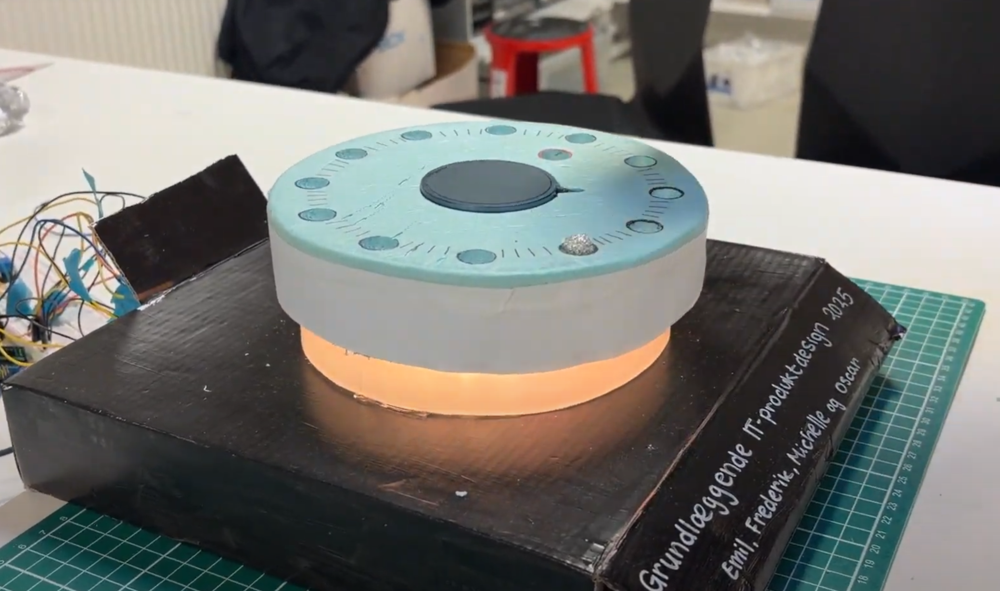
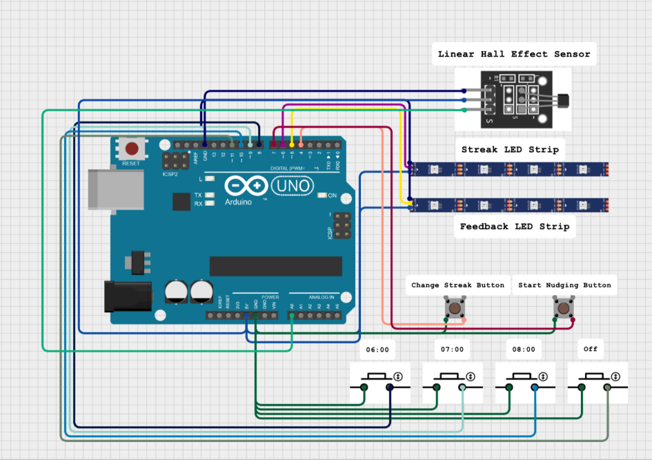

# Ambient Sleep Assistant – IT Product Design Project

**A tangible, ambient interface designed to improve sleep hygiene by restructuring evening routines.**

This project was developed as part of the course *Grundlæggende IT-produktdesign 2025* (Basic IT Product Design). It explores how ambient technology can help users disconnect from digital devices and establish healthier sleep habits.

## Problem Statement
Many people struggle with sleep deprivation due to unstructured evening routines and digital distractions (e.g., "doomscrolling") immediately before bed. Through user interviews and affinity diagramming, we identified that users lack a consistent trigger to start winding down and often fail to put their phones away at a reasonable hour.

Our core design question was:
> *"How can we use an ambient light display for the home to support building and maintaining a consistent evening routine that promotes better sleep?"*.

## The Solution
We designed a physical "base" for the smartphone that acts as a companion for the user's evening routine.

* **Ambient Nudging:** The device uses subtle, non-intrusive light cues to signal the start of the "wind-down" phase, avoiding the stress of loud alarms.
* **Tangible Interaction:** To stop the nudge and "commit" to sleep, the user must physically place their phone on the device. This action turns off the ambient light, signaling the end of the day.
* **Magnetic Docking:** The dock utilizes a wireless magnetic charger mount that interacts with the phone's internal magnets. This creates a satisfying physical "snap" to ensure correct alignment and charging.
* **Gamification (Streaks):** The device tracks consecutive days of successful routine adherence. A dedicated LED strip visualizes this "streak," providing positive reinforcement to motivate the user.
* **Analog Time Setting:** The concept features a tangible interface where the user sets their wake-up/bedtime by placing a physical silver ball in specific slots (simulated by buttons in this prototype), moving away from digital screens for configuration.

## Technical Implementation

The prototype is built on the Arduino platform, focusing on sensor integration and LED control.

### Hardware Stack
* **Microcontroller:** Arduino Uno[cite: 261].
* **Sensors:**
    * **Linear Hall Effect Sensor:** Detects the presence of the mobile phone via its magnetic field.
* **Actuators:**
    * **LED Strips:** Split into two segments—one for ambient feedback/nudging and one for displaying the user's streak.
* **Input:**
    * Physical buttons were used in this version to simulate the "Silver Ball" time-setting inputs (06:00, 07:00, 08:00) and to reset streaks.
* **Power:** USB powered for prototyping purposes.

### Software
* **Framework:** C++ via Arduino IDE.
* **Libraries:** Used the **Adafruit NeoPixel** library to control the addressable LED strips for smooth color transitions and status indication.

### Prototyping Materials
* **Form:** Constructed using foam modeling for rapid iteration.
* **Diffusion:** Utilized baking paper and cotton wool to diffuse the harsh LED light, creating a soft, ambient glow suitable for a bedroom setting ("Light bleeding" reduction).

